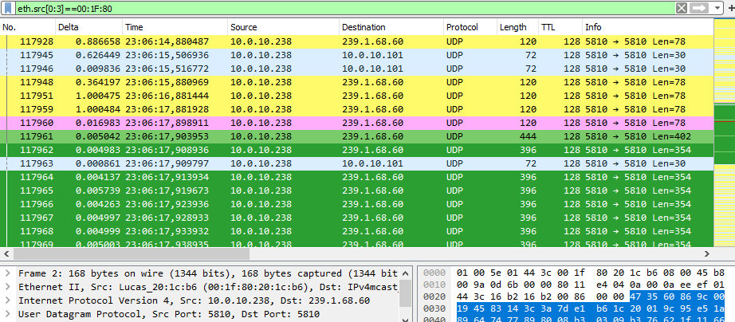

# Netzwerk Troubleshooting

## Grundlegende Checkliste

- [x] Der Netzwerkswitch stellt PoE nach Standard IEEE 802.3af (max. 15,4 W / 48 V) zur Verfügung
- [x] Es gibt keinen "Eingriff" in den Paketfluss (z.B. Firewalls, Gateways, Router)
- [x] Es gibt kein Bandbreitenlimit oder Bottleneck im Netzwerk
- [x] Green-GO Traffic ist isoliert von anderen Systemen (VLAN oder Physisch)
- [x] Sollten mehrere Konfigurationen im gleichen Netzwerk aktiv sein, darf die [Multicast Adresse](https://manual.greengoconnect.com/en/software/views/config/#config-settings) nicht für mehrere Konfigurationen verwendet werden.
- [x] Bei hohem Paketvorkommen sollte QoS konfiguriert sein (DSCP: 46)
- [x] Der Multicast Traffic des Green-GO Systems kommt überall an ([Wireshark](#wireshark), [Multicast Tester](http://www.dqnetworks.ie/toolsinfo/mcasttest/), [GGO-MTA](#green-go-mta))

## Häufige Probleme

### Software

#### Geräte werden nicht automatisch in der Software angezeigt

Sollten Green-GO Geräte nicht automatisch in der Connection View der Software erscheinen kann ein [manueller Netzwerkscan](https://manual.greengoconnect.com/en/getting-started/upgrade/#scan-your-network) durchgeführt werden.

Tauchen die Geräte nach diesem Scan mit dem Status <span class="status-dot purple"></span> `Boot Mode` oder <span class="status-dot orange"></span> `Unreachable` auf, sollte folgendes überprüft werden:

- [x] Die betroffenen Green-GO Geräte benutzen eine [v5 Firmware](https://manual.greengoconnect.com/en/getting-started/upgrade/#upgrade-your-devices).
- [x] Netzwerkkonfiguration aller Geräte und Computer ist untereinander kompatibel und ermöglicht eine _lokale_ Kommunikation.
- [x] Der Rechner ermpfängt Multicast Traffic auf UDP Port `5810`.<br>
Dies kann u.a. mit Tools wie [Wireshark](#wireshark), dem [Multicast Tester](http://www.dqnetworks.ie/toolsinfo/mcasttest/) von DQ Networks, oder der Python Terminal Applikation [GGO-MTA](#green-go-mta) überprüft werden.

??? warning "Wichtiger Hinweis für Firewalls"
    Die Applikation welche für die Netzwerkkommunikation verantwortlich ist trägt den Namen `Core(.exe)`. Diese Applikation versucht über die Ports `2001`, `2002` (TCP) und `5810`, `6464` (UDP) zu kommunizieren:

    - :material-microsoft-windows: `Core.exe` (Standard Pfad: `C:\Program Files (x86)\Green-GO Control\resources\Core.exe`)
    - :material-apple: `Core` (Standard Pfad: `Programme/Green-GO Control.app/Contents/Resourrces/Core`)

#### Geräte werden überhaupt nicht angezeigt

Dies ist in der Regel nur der Fall wenn überhaupt keine Kommunikation mit dem Netzwerk möglich ist.

- [x] Es gibt keine Firewall welche die Verbindung der Software blockiert.
- [x] Die Konfiguration der Netzwerkschnittstelle ist korrekt und erlaubt eine Kommunikation mit dem Green-GO System.
- [x] Die Ports 6464 und 5810 sind nicht blockiert.

??? warning "Wichtiger Hinweis für Firewalls"
    Die Applikation welche für die Netzwerkkommunikation verantwortlich ist trägt den Namen `Core(.exe)`. Diese Applikation versucht über die Ports `2001`, `2002` (TCP) und `5810`, `6464` (UDP) zu kommunizieren:

    - :material-microsoft-windows: `Core.exe` (Standard Pfad: `C:\Program Files (x86)\Green-GO Control\resources\Core.exe`)
    - :material-apple: `Core` (Standard Pfad: `Programme/Green-GO Control.app/Contents/Resourrces/Core`)

#### Einzelne Fimware Updates schlagen fehl

Das kann leider immer mal wieder vorkommen. In manchen Fällen "gibt" die Software zu früh auf, nachdem das Gerät in den <span class="status-dot purple"></span> `Boot Mode` neugestartet wurde. Das Gerät ist noch nicht verfügbar und wartet z.B. noch auf eine IP-Adresse.

1. In einem solchen Fall kann das betroffene Gerät einfach mit Hilfe des <span class="button-outline">Remove Offline Devices</span> Buttons aus der Software entfernt werden.
2. Anschließend muss ein _manueller Scan_ durch einen Klick auf den <span class="button-outline">Update</span> Button und die folgende `Scan` Option erfolgen.
3. Das Gerät sollte nun mit dem Status <span class="status-dot purple"></span> `Boot Mode` erscheinen. Das Firmwareupdate läuft nun in der Regel problemlos [wie gewohnt](https://manual.greengoconnect.com/en/guides/firmware/#flash-the-firmware) durch.

??? info "Nützliche Information"
    Im Zweifel kann das Gerät für ein Firmwareupdate [manuell](https://manual.greengoconnect.com/en/glossary/?h=forced+boot#forced-boot-mode) in den `Boot Mode` gestartet werden. Dies verhindert den Timeout welcher durch den IP-Wechsel verursacht werden kann.
    
    Anschließend muss das Gerät durch einen manuellen Scan (Schritt 2) gefunden werden.
    
    Diese Prozedur sollte ebenfalls ein problemloses Firmwareupdate über den <span class="button-outline">Update</span> Button und die folgende `Scan` Option ermöglichen.

#### <span class="status-dot red"></span> Geräte ändern Ihren Status immer wieder auf "Lost"

Dies ist in der Regel der Fall wenn es Unterbrechungen im Paketfluss kommt. Die Software fragt den Status aller Geräte regelmäßig ab und erwartet ein Paket als Antwort.

Da Green-GO für diese Kommunikation ausschließlich [UDP Pakete](index.md#udp-ports) benutzt kann eine Zustellung leider nicht garantiert werden und ist stark abhängig von der eingesetzten Netzwerkinfrastruktur.

Eine häufige Ursache für einen "flackernden" Status ist z.B. eine drahtlose WLAN Verbindung, diese kann abhängig vom AP und der Konfiguration den Multicast-Datenverkehr "verschlucken". 

??? info "Nützliche Information"
    Sollte ein Antwort-Paket mal nicht am Rechner ankommen wird der Verbindungsstatus des Geräts auf "Lost" umgestellt. Dies muss nicht immer bedeuten, dass das betroffene Green-GO Gerät ein Problem hat. Es ist durchaus möglich das eine Antwort auf der "Strecke" geblieben ist.

### Geräte

#### <span class="status-dot blink__blue-red"></span> Statusindikatoren blinken rot

Sollten die Statusindikatoren eines Geräts <span class="status-dot blink__blue-red"></span> rot blinken ist in der Regel kein weiteres Green-GO Gerät mit gleicher [Konfiguration](https://manual.greengoconnect.com/en/getting-started/software/#adopting-devices) im lokalen Netzwerk vorhanden.

- [x] Alle Geräte haben eine korrekte Netzwerkkonfiguration und kommunizieren im gleichen lokalen Netwerk.
- [x] Alle Geräte benutzen eine Konfiguration mit [gleicher Konfigurations ID](https://manual.greengoconnect.com/en/software/views/config/#config-info).<br>
    (Setup Menü --> Info --> Config --> ID: XXXX)
- [x] Die Geräte sind in der Lage sich gegenseitig zu Pingen<br>
    (Setup Menü --> Info --> IP --> Ping)

#### Sprache wird abgehackt oder verändert übertragen

Da Green-GO UDP Multicast für die Kommunikation benutzt muss der Netzwerkverkehr "non-blocking" ohne zusätzliches Processing von der Netzwerk-Infrastruktur durchgeleitet werden.

Unterbrochenes bzw. veränderte Audiosignale werden in der Regel dann produziert, wenn die Paketreihenfolge zu stark abweicht, oder der [Jitter](index.md#jitter-und-latenzen) einer Verbindung zu hoch ist. In einem solchen Falle produziert das Green-GO Audio-Codec Artefakte.

Eine weitere Ursache für dieses Problem kann auch ein (zu hoher) Paketverlust bei der Kommunikation mit der _Multicast-Adresse_ der Systemkonfiguration sein.

Für eine weiterführende Analyse kann u.a. das Programm [Wireshark](#wireshark) benutzt werden.

## Netzwerk Analyse

Für eine vollständige Analyse kann es erforderlich sein den Paketfluss eines spezifischen Switchports zu überwachen. Dies ermöglicht eine direkte Sicht auf den Datenverkehr eines problembehafteten Gerät.

Ein solcher Mittschnitt kann zum Beispiel mit Hilfe einer sogenannten [Network TAP](https://www.dualcomm.com/products/usb-powered-10-100-1000base-t-network-tap) erzeugt werden.

<div class="svg-container svg-center width-80" data-filename="../../assets/images/network-tap"></div>

Alternativ kann auch der Datenverkehr eines bestimten Switchports auf einen mit dem Rechner verbundenen Switchport dupliziert werden. Diese Funktionalität ist abhängig vom Switchmodel und erfordert eine Anpassung der Switchkonfiguration.
### Wireshark

- **Link:** [wireshark.org](https://www.wireshark.org/download.html)
- **Einfärbungsregeln**: [Download](../assets/files/Green-GO_ColoringRules)

Wireshark kann hilfreich sein um Netzwerkprobleme in einem System zu analysieren. Das Program ermöglicht einen schnellen Überblick über generelle "Erreichbarkeiten", Latenzprobleme aber auch tiefer gehende Analysen.

<figure markdown>

</figure>

#### Konfiguration

Damit Wireshark optimal funktioniert sollten ein paar Einstellungen überprüft und vorgenommen werden:

##### Promiskuitiver Modus

Diese Einstellung ist abhängig vom Treiber des Netzwerk Interfaces und ist möglicherweise nicht immer verfügbar.

Sofern dieser Modus verfügbar ist, sollte dieser aktiviert sein. Wenn aktiv, wird das Interface beim Mittschnitt korrekt initialisiert.

<figure markdown>

<figcaption>Bearbeiten --> Einstellungen --> Mitschnitt</figcaption>
</figure>

##### Anzeige und Spalten

Wireshark ist ein mächtiges Werkzeug welches umfangreich konfiguriert werden kann. Für den Anfang kann es aber hilfreich sein folgende Einstellungen vorzunehmen:

###### Zeitanzeige

Um Ereignisse besser identifizieren zu können, kann es hilfreich sein die Zeitanzeige auf `Uhrzeit (01:02:03.123456)` zu stellen (Ansicht --> Zeitanzeige --> Uhrzeit).

###### Delta Timing Spalte

Um die Latenz zwischen angezeigten (gefilterten) Paketen besser im Überblick behalten zu können, kann es helfen eine zusätzliche Spalte für diese Berechnung anzulegen:

<figure markdown>

<figcaption>Bearbeiten --> Einstellungen --> Darstellung --> Spalten</figcaption>
</figure>

Wichtig ist hier, dass als Spaltentyp `Delta time displayed` ausgewählt wird.

##### Green-GO Pakete Einfärben

Es kann hilfreich sein die Green-GO Pakete mit Hilfe von Farbfiltern einzufärben um Probleme besser zu visualisieren. Die zum Download stehenden Einfärbungsregeln können einfach importiert und verwendet werden:

<figure markdown>

<figcaption>Ansicht --> Einfärbungsregeln</figcaption>
</figure>

#### Datenverkehr Filtern

Es können verschiedene Filtermechanismen verwendet werden um die Menge an Paketen zu begrenzen und für eine bessere Übersicht zu sorgen.

=== "Mitschnittfilter"

    Ein Mittschnittfilter kann hilfreich sein um Umfang eines Mittschnitts auf das Notwendige zu reduzieren. Dies kann die Dateigröße eines Mittschnitts signifikant verringern.
    
    !!! warning ""
        :material-alert-outline: **Achtung:** Es ist nicht möglich ausgefilterte Pakete im Nachhinein wiederherzustellen, daher sollte dieser Filtermechanismus mit vorsicht verwendet werden.

    

    Folgende Filter-Statements können mit den Operatoren `&&` (und), `||` (oder) logisch verknüpft und mit `()` gruppiert werden.

    `host <ip.address>`
    : Ermöglicht den Mittschnitt auf bestimte IP-Adressen zu begrenzen.

    `port 5810`
    : Ermöglicht den Mittschnitt auf einen bestimten Port zu begrenzen.

    `not <statement>`
    : Das `not` Statement ermöglicht es etwas explizit vom Mittschnitt auszuschließen.<br>
    Das Statement `not host 169.254.32.187` schließt alle Pakete von und zum Host `169.254.32.187` vom Mittschnitt aus.

=== "Displayfilter"

    Ein Displayfilter limitiert die aktuelle Paketliste, hat aber keinen Einfluss auf den Mittschnitt. Pakete werden unabhängig vom Displayfilter weiter aufgezeichnet.

    

    `eth.addr[0:3] == 00:1F:80`
    : Dieses Statement überprüft ob Pakete die OUI von ELC (`00:1F:80`) in den ersten drei Bytes der MAC-Adresse verwenden.

    `ip.dst == <ip.destination>`
    : Dieses Statement filtert Pakete die an eine gegebene IP-Adresse adressiert sind. 

    `ip.src == <ip.source>`
    : Dieses Statement filtert Pakete die von einer gegebenen IP-Adresse versendet wurden. 

    `udp.port == 5810`
    : Dieses Statement filtert Pakete auf [UDP Port](index.md#udp-ports) `5810`.

    `data.data[0:2] == 4735`
    : Dieser Filter überprüft die ersten zwei Bytes eines Pakets auf für Green-GO relevante Kommunikation.


### Green-GO MTA

**Link:** [github.com/lampensau/ggo-mta](https://github.com/lampensau/ggo-mta)


Eine Python (3.x) Terminal Applikation welche Verbindungsstatistiken zu Green-GO Konfigurations Subscribern (Geräte) aufführt.

#### Installation der Vorraussetzungen

Damit diese Applikation funktionieren kann, müssen `Python 3` und der Paketmanager `pip` _lokal_ installiert sein.

##### Python 3

Eine existierende Installation kann wie folgt über ein Terminalfenster verifiziert werden:

```{title="Terminal Fenster"}
$ python3 --version
Python 3.11.4
```

=== ":simple-linux: Linux (Debian/Ubuntu)"

    Um Python 3 zu installieren muss folgender Befehl ausgeführt werden:

    ```{.bash title="Linux Shell"}
    sudo apt update && sudo apt install python3
    ```

=== ":material-apple: MacOS"

=== ":material-microsoft-windows: Windows"

##### pip

Eine existierende Installation kann wie folgt über ein Terminalfenster verifiziert werden:

```{title="Terminal Fenster"}
$ pip3 --version
pip 23.2.1 from /path/to/python-pip/executable
```

=== ":simple-linux: Linux (Debian/Ubuntu)"

    Um den Paketmanager `pip` zu installieren muss folgender Befehl ausgeführt werden:

    ```{.bash title="Linux Shell"}
    sudo apt update && sudo apt install python3-pip
    ```

=== ":material-apple: MacOS"

=== ":material-microsoft-windows: Windows"

##### Andere Vorraussetzungen

=== ":simple-linux: Linux (Debian/Ubuntu)"

=== ":material-apple: MacOS"

=== ":material-microsoft-windows: Windows"