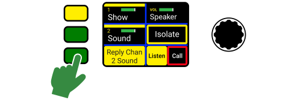
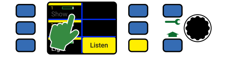
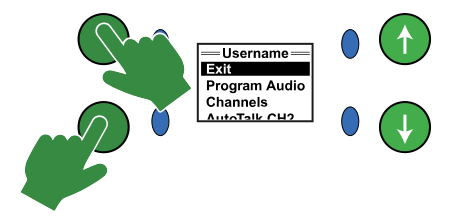

# Benutzung einer Green-GO Station

**Handbuch:** [Link](https://manual.greengoconnect.com/en/getting-started/usage/)

## Benutzeroberfläche

### Statusfarben

Ein Green-GO Gerät informiert den Anwender über den Geräte-, System- und Kanalstatus mit Hilfe von Farben.

Mit der _Default-Konfiguration_ `Factory Default` werden folgende Farben für den Kanalstatus verwendet:

| Farbe {width=5%}| Verhalten {width=12%}| Status {width=20%}| Beschreibung {width=63%}|
|:-:|:-|:-|:-|
|  | Statisch | Free | Dem Kanal ist kein Kommunikationsziel [zugewiesen](https://manual.greengoconnect.com/en/getting-started/software/#channel-assignments). Der Kanal ist nicht belegt. |
|  | Statisch | No Member | Es gibt kein Green-GO Gerät welches auf diesem Kanal empfängt. |
|  | Statisch | Idle | Der Kanal ist belegt, es gibt empfangende Geräte und der Kanal ist inaktiv. |
|  | Statisch | Active | Ein Green-GO Gerät oder User hat den Kanal für eine Übertragung [geöffnet](https://manual.greengoconnect.com/en/getting-started/usage/#talking) - es wird aber noch kein Audio übertragen. |
|  | Statisch | Active VOX | Der Kanal _empfängt_ [Audio Kommunikation](https://manual.greengoconnect.com/en/getting-started/usage/#receiving-voice-communication). |
|  | Blinkend | Active Muted | Der Kanal ist [_stumm geschaltet_](https://manual.greengoconnect.com/en/getting-started/usage/#muting-a-channel) und empfängt Audio Kommunikation. |
|  | Statisch | Talk | Der Kanal ist für eine Übertragung [_geöffnet_](#talking) und wird den aktiven Input übertragen. |
|  | Statisch | Autotalk | Der Kanal wurde _automatisch_ durch den Kanalmodus `Autotalk` für eine Übertragung geöffnet. |
|  | Statisch | Call | Auf dem Kanal wird ein Rufzeichen (Call) gesendet. |
|  | Blinkend | Alert Call | Auf dem Kanal wird ein Alarm-Rufzeichen gesendet. |
|  | Blinkend | Cue Attention | Der Kanal empfängt oder sendet die erste Stufe (Attention) des Lichtzeichens (Cue). |
|  | Statisch | Cue GO | Der Kanal empfängt oder sendet die zweite Stufe (Ready) des Lichtzeichens. |
|  | Statisch | Cue GO | Der Kanal empfängt oder sendet die dritte Stufe (GO) des Lichtzeichens. |

!!! tip ""
    :material-lightbulb-outline: **Tip:** Es ist möglich die Statusfarben eines Green-GO Systems [anzupassen](https://manual.greengoconnect.com/en/software/views/config/#config-colors)!

### Kanal-UI

Jede Green-GO Sprechstelle verfügt über mindestens einen Display welcher Kanalinformationen darstellt.

Die Anzahl der Kanäle im direkten Zugriff variiert je nach Gerätetyp oder -konfiguration. Grundsätzlich bleibt die Struktur aber über alle Möglichkeiten gleich:

{.img-center .width-80 inline=true}

Channel Status
:  Das rote `X` zeigt an, dass die lokale [Green-GO Engine](../glossary.md#green-go-engine) kein Gerät oder User als für den Kanal finden kann.

Channel ID
:  Dies zeigt die ID des Kanals an. Grundsätzlich hat ein Green-GO User Zugriff auf die Kanäle 1 bis 32.

Display Name
:  Der Name oder Anzeigename des Kanalziels ([User](../glossary.md#user) oder [Gruppe](../glossary.md#group)).

Channel Color
:  Die Kanalfarbe kann verwendet werden, um zwischen Kommunikationszielen zu unterscheiden. Die Farbe wird durch das Kanalziel selbst ([User](../glossary.md#user) oder [Gruppe](../glossary.md#group)) definiert.

Channel Volume
:  Die aktuelle Lautstärke des Kanals. Ein nicht gefüllter balken repräsentiert einen stumm geschalteten Kanal.

!!! tip ""
    :material-lightbulb-outline: **Tip:** Die Benutzeroberfläche einer Sprechstelle kann konfiguriert werden. Bitte lese die [Geräte-Dokumentation](https://manual.greengoconnect.com/en/devices/) der entsprechenden Sprechstelle, um mehr zu erfahren.

## Kanal Bedienung

### Kanal Ansprechen (Talk)

Um einen Kanal anzusprechen, muss die entsprechende ++button++ gedrückt werden. Dies aktiviert das Mikrofon für den Kanal und ändert den Kanalstatus auf Talk.

Ein _offener_ Kanal wird von der Status-LED durch ein  grünes leuchten signalisiert.

=== "BPX & WBPX Beltpacks"

    {.img-center .width-60 inline=true}

=== "MCX, MCXD & WPX stations"

    {.img-center .width-80 inline=true}

Mit den _werkseitigen Standardeinstellungen_, sind zwei Funktionen für das Besprechen eines Kanals (`Latch/Momentary`) mit einer Funktionstaste verknüpft:

1. **Drücken und halten:** Kanal ist für die Dauer des Knopfdrucks geöffnet und wird direkt nach dem Loslassen wieder geschlossen. ([`Momentary`](https://manual.greengoconnect.com/en/glossary/#momentary))
2. **Kurzes Drücken:** Schaltet den Kanal zwischen _geöffnet_ und _geschlossen_, abhängig von aktuellen Status. ([`Latch`](https://manual.greengoconnect.com/en/glossary/#latch))

Die Kopffunktionalität kann einfach in den Einstellungen eines Kanals angepasst werden. Dies kann entweder [direkt am Gerät](https://manual.greengoconnect.com/en/getting-started/devices/#channel-assignments-configuration) oder mit Hilfe der [Green-GO Control Software](https://manual.greengoconnect.com/en/software/tree/users/#channels-tab) erfolgen.

### Audio Empfangen (VOX)

Das Gerät überträgt Audio mit der eingestellten Kanallautstärke an den aktiven Audioausgang. Bei Empfang einer Sprachverbindung wechselt der entsprechende Kanalstatus auf  gelb um dies zu signalisieren.

=== "BPX & WBPX Beltpacks"

    {.img-center .width-60 inline=true}

=== "MCX & MCXD Sprechstellen"

    {.img-center .width-70 inline=true}   

=== "WPX Wandsprechstelle"
    
    {.img-center .width-70 inline=true}

Nach dem Empfang des letzten Audiosignals bleibt ein Kanal standardmäßig für 1 Sekunde länger  aktiv, um dem Benutzer Zeit zu geben, den Empfangskanal zu identifizieren und die Antwortfunktion zu nutzen. Dieses Verhalten kann in den Benutzereinstellungen über die Eigenschaft [`Active Time`](https://manual.greengoconnect.com/en/devices/mcx/#active-time) konfiguriert werden.

{.img-inline .width-20 inline=true}

Sollte ein User eine direkte Kommunikation von einem anderen User erhalten, der nicht auf einem der 32 Kanäle konfiguriert ist, wird die Kommunikation auf einem zusätzlichen 33. Kanal ([`temp direct`](https://manual.greengoconnect.com/en/glossary/#direct-channel)) übertragen. In einem solchen Falle informiert ein [konfigurierbares Pop-up](https://manual.greengoconnect.com/en/devices/mcx/#popup) den Benutzer über die Informationen des Absenders.

### Gespräche Beantworten

Green-GO ermöglicht es dem Benutzer, jede eingehende  Sprachkommunikation mit nur einem Tastendruck zu beantworten. In den Standardeinstellungen reagiert die Antwortfunktion auf den Kanal, der **zuletzt** eine Kommunikation empfangen hat ([`Reply Mode: Last`](https://manual.greengoconnect.com/en/devices/bpx/?h=reply+mode#reply-mode)). Sie kann jedoch so konfiguriert werden, dass sie auf **alle** derzeit aktiven eingehenden Sprachkommunikationen antwortet.

!!! tip ""
    :material-lightbulb-outline: **Tip:** Die Einstellung [`Active Time`](https://manual.greengoconnect.com/en/devices/mcx/#active-time) beeinflusst die Dauer, die ein Kanal weiterhin als  aktiv angezeigt wird.
    
    Diese Einstellung hat auch Einfluss darauf, wie lange ein Kanal für die Antwortfunktion zur Verfügung steht, nachdem eine Kommunikation empfangen wurde.

=== "BPX & WBPX Beltpacks"

    {.img-inline .width-25 inline=true}

    Die Klickfunktion des ++bpx-enc1++ und des ++bpx-enc2++ ist immer mit der Antwortfunktion verknüpft. Wird einer der Enkoder in Richtung Display gezogen, während eine Kommunikation empfangen wird, antwortet das Gerät auf den zuletzt aktiven Kanal.

    {.img-inline-right .width-20 inline=true}

    Wird einer der Enkoder nach oben gezogen, zeigt der [Statusbildschirm](https://manual.greengoconnect.com/en/devices/bpx/#status-screen) des Geräts in der mittleren Sektion die Kanäle an, welche gerade durch die Antwortfunktion aktiviert wurden.

=== "MCX & MCXD Sprechstellen"

    {.img-inline .width-50 inline=true}

    Die Antwortfunktion muss der Benutzer&shy;oberfläche [zugewiesen werden](https://manual.greengoconnect.com/en/devices/mcx/#configuring-the-user-interface), bevor diese zur Benutzung verfügbar ist.
    
    Wenn verfügbar, ermöglicht die ++button++ der Funktion das Antworten auf aktive Kanäle, abhängig von der Einstellung des `Reply Mode`. Eine Berührung des ++touchscreen++ setzt die Antwortfunktion wieder zurück.

    Ist die Funktion inaktiv, zeigt sie den lokalen Benutzer des Geräts an.

=== "WPX Wandsprechstelle"

    {.img-inline .width-50 inline=true}

    Die Antwortfunktion muss der Benutzer&shy;oberfläche [zugewiesen werden](https://manual.greengoconnect.com/en/devices/mcx/#configuring-the-user-interface), bevor diese zur Benutzung verfügbar ist.
    
    Wenn verfügbar, ermöglicht die ++button++ der Funktion das Antworten auf aktive Kanäle, abhängig von der Einstellung des `Reply Mode`. Eine Berührung des ++touchscreen++ setzt die Antwortfunktion wieder zurück.

    Ist die Funktion inaktiv, zeigt sie den lokalen Benutzer des Geräts an.

### Kanal Lautstärke

Es ist möglich, die Lautstärke für jeden Kanal einzustellen und damit den idealen Kanalmix zu erstellen.

!!! note ""
    :material-chat-alert-outline: **Hinweis:** Die visuelle Pegelanzeige für die Kanallautstärke ist nicht linear. Der untere Teil des verfügbaren Bereichs zeigt keinen visuellen Unterschied um dem Benutzer ein besseres visuelles Feedback für den entscheidenden Pegelbereich zu geben.

=== "BPX & WBPX Beltpacks"

    Ein Green-GO Beltpack ermöglicht den direkten Zugriff auf die ersten 2 - 4 Kanäle des verknüpften Users, je nach dem konfigurierten [UI-Modus](https://manual.greengoconnect.com/en/devices/bpx/#ui-modes).

    {.img-center .width-60 inline=true}

    Die Kanallautstärke kann einfach mit Hilfe der Kanaltaste und der Drehbewegung eines Enkoders reguliert werden.

    Die Lautstärkeanzeige unter dem Kanalnamen zeigt die aktuelle Lautstärke an.

    !!! warning ""
        :material-alert-outline: **Warunung:** Eine Änderung der Kanallautstärke über das Kanal-UI öffnet immer den Kanal für die Sprachkommunikation.

    !!! tip ""
        :material-lightbulb-outline: **Tip:** Weitere Kanäle können über die [erweiterte Kanalansicht](https://manual.greengoconnect.com/en/devices/bpx/#extended-channel-view) bedient und eingestellt werden.

=== "MCX & MCXD Sprechstellen"

    {.img-center .width-60 inline=true}

    Der [Listen-Screen-Modus](https://manual.greengoconnect.com/en/devices/mcx/#screen-function-switches) muss aktiviert sein, um die Lautstärke eines Kanals auf einer MCX- oder MCXD Sprechstelle zu regeln.
    
    Ist der Modus aktiviert, wird die Lautstärke des Kanals über den Touchscreen-Bereich des Kanals und die Drehung des Encoders erhöht oder verringert. Die aktuelle Kanallautstärke wird von der Pegelanzeige oberhalb des Kanalnamens angezeigt.

=== "WPX Wandsprechstelle"

    {.img-center .width-70 inline=true}

    Der [Listen-Screen-Modus](https://manual.greengoconnect.com/en/devices/mcx/#screen-function-switches) muss aktiviert sein, um die Lautstärke eines Kanals auf einer WPX Wandsprechstelle zu regeln.
    
    Ist der Modus aktiviert, wird die Lautstärke des Kanals über den Touchscreen-Bereich des Kanals und die Drehung des Encoders erhöht oder verringert. Die aktuelle Kanallautstärke wird von der Pegelanzeige oberhalb des Kanalnamens angezeigt.

#### Kanal Stumm Schalten

=== "BPX & WBPX Beltpacks"

    {.img-center .width-60 inline=true}

    {.img-inline-right .width-25 inline=true}

    Um einen der ersten 2 - 4 Kanäle eines Benutzers stumm zu schalten, muss eine der verfügbaren Kanaltasten gedrückt und einer der beiden Enkoder in Richtung des Displays gezogen werden.

    !!! warning ""
        :material-alert-outline: **Warning:** Adjusting the channel volume in direct access will always open the channel for voice communication.

    !!! tip ""
        :material-lightbulb-outline: **Tip:** The rest of the channels can be accessed and adjusted through the [Extended Channel View](#)<!-- Link needs to be set when device manual is ready -->.

=== "MCX & MCXD Sprechstellen"

    {.img-center .width-70 inline=true}

    With the [listen screen mode](../devices/mcx.md#operation-mode-switches) enabled, a channel's ++touchscreen++ section can be tapped to mute or unmute the channel.

=== "WPX Wandsprechstelle"

    {.img-center .width-70 inline=true}

    With the [listen screen mode](../devices/mcx.md#operation-mode-switches) enabled, a channel's ++touchscreen++ section can be tapped to mute or unmute the channel.

The volume meter on top of the [channel UI](#user-interface) will become hollow as soon as the channel is muted and return to the previous set volume when unmuted. The previous set channel volume will be stored and recalled upon muting or unmuting, respectively.

### Kanal Rufen (Call)

Green-GO supports call signs with an alert signal on each of the 32 user channels. Each channel can be configured to enable or disable the sending and receiving of call signals.

Should a channel receive or send a call signal, the channel status will change to  red and, after a short while, to blinking  red and white, signaling the [alert call](../glossary.md#alert-call).

=== "BPX & WBPX Beltpacks"

    Green-GO belt packs feature several [user interface presets](#) that influence how a call sign can be sent to a channel. To find more about the available user interface presets, check out the corresponding device manual.

    | 2-Channel Mode {: .three-col} | 3-Channel Mode {: .three-col} | Extended Channel View {: .three-col} |
    |:-|:-|:-|
    | {.img-center inline=true} | {.img-center inline=true} | {.img-center inline=true} |
    | A belt pack using the [2-channel UI-mode](../devices/bpx.md#ui-modes) will feature direct access to call signs on channels 1 and 2 on  ++bpx-btn3++ or ++bpx-btn4++, respectively. | The [3-channel UI-mode](../devices/bpx.md#ui-modes) features access to the call function on ++bpx-btn4++ as soon as any of the three first channels are open. | The [Extended Channel View](../devices/bpx.md#extended-channel-view) allows access to all 32 user channels. A call sign can be sent to the selected channel by pressing ++bpx-btn2++. |

=== "MCX & MCXD Sprechstellen"

    {.img-center .width-60 inline=true}

    The [call screen mode](../devices/mcx.md#operation-mode-switches) needs to be active on the device to enable the **sending** of call signals. When activated, the touch on a channel's ++touchscreen++ section will send a call sign to the assigned target(s).

    !!! tip ""
        :material-lightbulb-outline: **Tip:** It is possible to send a call sign with the press of a channel's ++button++. The property [`Button`](../devices/mcx.md#button) defines if the buttons should change their function to the active [screen mode](../devices/mcx.md#screen-function) or always open a channel for voice communication.

=== "WPX Wandsprechstelle"

    {.img-center .width-60 inline=true}

    The [call screen mode](../devices/mcx.md#operation-mode-switches) needs to be active on the device to enable the **sending** of call signals. When activated, the touch on a channel's ++touchscreen++ section will send a call sign to the assigned target(s).

    !!! tip ""
        :material-lightbulb-outline: **Tip:** It is possible to send a call sign with the press of a channel's ++button++. The property [`Button`](../devices/mcx.md#button) defines if the buttons should change their function to the active [screen mode](../devices/mcx.md#screen-function) or always open a channel for voice communication.

### Kanal Lichtzeichen (Cue)

{.img-inline-right .width-50 inline=true}

A cue signal is sent by tapping the channel's ++touchscreen++ section while using the [cue screen mode](../devices/mcx.md#operation-mode-switches) on an MCX rack or MCXD desktop station. The first tap will initiate an  attention cue. A second tap on the ++touchscreen++ will directly send the  GO cue and clear the channel after the local [`Cue Timeout`](../devices/mcx.md#cue-timeout) reaches 0.

!!! tip ""
    :material-lightbulb-outline: **Tip:** It is possible to send a cue sign with the press of the channel's ++button++. The option [`Button`](../devices/mcx.md#button) defines if the buttons function should follow the active screen mode ([listen](../glossary.md#listen), [call](../glossary.md#call), [cue](../glossary.md#cue)) or always open a channel for voice communication.

### Receiving and answering a cue sign

Incoming cue signs will be displayed with a pop-up on the screen. Additionally, the channel status will change its [color](#status-colors) according to the cue stage.<!-- The pop-ups can be easily cleared by pressing any ++button++ on the device.-->

=== "BPX & WBPX Beltpacks"

    {.img-inline .width-25 inline=true}

    Answering an incoming  attention cue is the same as [answering any communication](#answering-communications): Pulling one of the encoders up towards the display. 
    
    <!--The pop-ups showing the status and sender information of the signal can be cleared by pressing any of the four ++bpx-btns++ on the front of the device.-->

=== "MCX & MCXD Sprechstellen"

    | Answer incoming Attention Cue {: .two-col} | Incoming Hold or Go Cues {: .two-col} |
    | --- | --- |
    | {.img-center inline=true} | {.img-center inline=true} |
    | An incoming `Attention` cue will be displayed with its sender information in a pop-up on the third touchscreen. The Setup or Shift buttons can be pressed to answer incoming `Attention` cues. | An incoming `Ready` or `GO` cue will be displayed in a pop-up together with the sender's information on the third touchscreen. <!--The pop-up can be cleared by pressing any ++button++ of the device.--> |

<!-- === "WPX Wandsprechstelle"

    {==I'm honestly lost on how the answer function works on the WPX. Was it pushing the encoder while receiving a communication?==} -->

## Setup Menü

The setup menu allows for persistent changes on the device and user configuration that can be [synced back](../software/tree/devices.md#devices-out-of-sync) to the main configuration with the help of the Green-GO Control software. The setup menu can be accessed on each device and provides access to almost all settings and options.

### User stations

=== "BPX & WBPX Beltpacks"

    The [BPX](../devices/bpx.md) and [WBPX](../devices/wbpx.md) belt packs feature two methods to access the setup menu:

    | Method A {: .two-col} | Method B {: .two-col} |
    | :- | :- |
    | {.img-center inline=true} | {.img-center inline=true} |
    | Pull the ++bpx-enc1+bpx-enc2++ up towards the display. | Press ++bpx-btn1+bpx-btn3++ after pulling and holding either the ++bpx-enc1++ or ++bpx-enc2++ up towards the display. |

=== "MCX & MCXD Sprechstellen"

    {.img-inline .width-50 inline=true}

    The [MCX rack](../devices/mcx.md) and [MCXD desktop](../devices/mcxd.md) stations provide easy access to the setup menu using a dedicated ++setup++ button and navigated with the help of the encoder right next to it.

=== "WPX Wandsprechstelle"

    {.img-inline .width-50 inline=true}

    The setup menu on the [WPX wall panel](../devices/wpx.md) is hidden behind the press of the ++encoder++. When pressed, the 6th ++touchscreen++ section on the bottom right will provide access to the setup menu if tapped.

<!-- === "MCXEXT & MCXDEXT extensions"

    {.img-center .width-40 inline=true}
    The setup menu on the [MCXEXT rack](../devices/mcxext.md) or [MCXDEXT desktop](../devices/mcxext.md) channel extensions is only available if **not connected** to a master [MCX rack](../devices/mcx.md) or [MCXD desktop](../devices/mcxd.md) station. It can be accessed with the last ++button++ on the bottom-right of the 4th display. 
    The two buttons above can be used to navigate the setup menu. -->

### Interfaces

=== "19" Rack-Interfaces"

     {.img-inline .width-50 inline=true}

    Pressing the ++encoder++ will bring up the setup menu on all 19" rack Green-GO interfaces like the [audio InterfaceX](../devices/interfacex.md), [Q4WR quad 4-wire interface](../devices/q4wr.md),  and many more. 
    The setup menu is navigated by scrolling or clicking the ++encoder++.

=== "1CH Interfaces"

     {.img-inline .width-50 inline=true}
     
    Pressing ++bpx-btn1+bpx-btn2++ at the same time brings up the setup menu on one-channel interfaces like the [RDX radio interface](../devices/rdx.md) or [SI4WR 4-wire interface](../devices/si4wr.md).
    
    In the setup menu, ++bpx-btn3++ and ++bpx-btn4++ go up and down. ++bpx-btn1++ affirms a selection, and ++bpx-btn2++ exits the current menu or selection.

#### Accessories

The limited user interface on accessories like the WAA wireless antenna or the BCN beacon light only allows for little functionality.

Please refer to the device documentation for a complete description of the provided functionality.