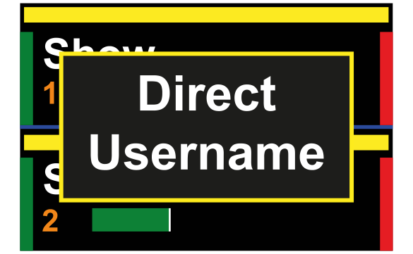
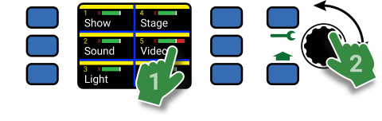
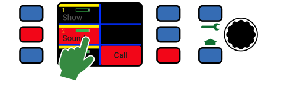
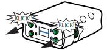
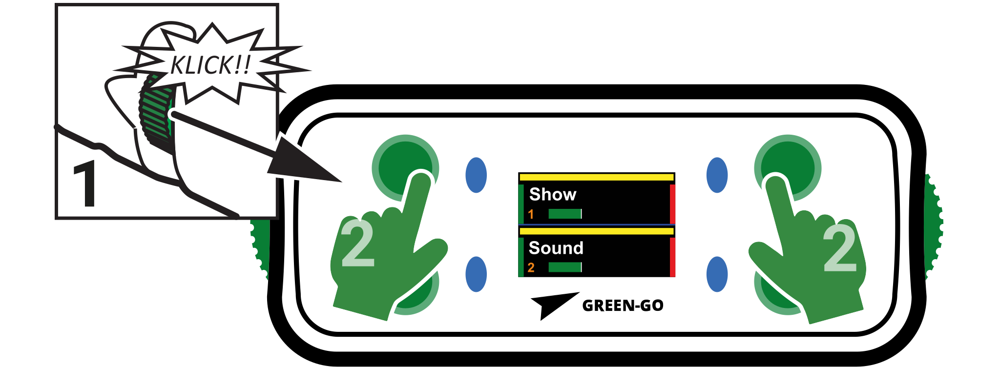
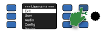
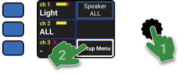
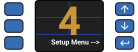
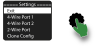

# Benutzung einer Green-GO Station

**Handbuch:** [Link](https://manual.greengoconnect.com/en/getting-started/usage/)

## Benutzeroberfläche

### Statusfarben

Ein Green-GO Gerät informiert den Anwender über den Geräte-, System- und Kanalstatus mit Hilfe von Farben.

Mit der _Default-Konfiguration_ `Factory Default` werden folgende Farben für den Kanalstatus verwendet:

| Farbe {width=5%}| Verhalten {width=12%}| Status {width=20%}| Beschreibung {width=63%}|
|:-:|:-|:-|:-|
|  | Statisch | Free | Dem Kanal ist kein Kommunikationsziel [zugewiesen](https://manual.greengoconnect.com/en/getting-started/software/#channel-assignments). Der Kanal ist nicht belegt. |
|  | Statisch | No Member | Es gibt kein Green-GO Gerät welches auf diesem Kanal empfängt. |
|  | Statisch | Idle | Der Kanal ist belegt, es gibt empfangende Geräte und der Kanal ist inaktiv. |
|  | Statisch | Active | Ein Green-GO Gerät oder User hat den Kanal für eine Übertragung [geöffnet](https://manual.greengoconnect.com/en/getting-started/usage/#talking) - es wird aber noch kein Audio übertragen. |
|  | Statisch | Active VOX | Der Kanal _empfängt_ [Audio Kommunikation](https://manual.greengoconnect.com/en/getting-started/usage/#receiving-voice-communication). |
|  | Blinkend | Active Muted | Der Kanal ist [_stumm geschaltet_](https://manual.greengoconnect.com/en/getting-started/usage/#muting-a-channel) und empfängt Audio Kommunikation. |
|  | Statisch | Talk | Der Kanal ist für eine Übertragung [_geöffnet_](#talking) und wird den aktiven Input übertragen. |
|  | Statisch | Autotalk | Der Kanal wurde _automatisch_ durch den Kanalmodus `Autotalk` für eine Übertragung geöffnet. |
|  | Statisch | Call | Auf dem Kanal wird ein Rufzeichen (Call) gesendet. |
|  | Blinkend | Alert Call | Auf dem Kanal wird ein Alarm-Rufzeichen gesendet. |
|  | Blinkend | Cue Attention | Der Kanal empfängt oder sendet die erste Stufe (Attention) des Lichtzeichens (Cue). |
|  | Statisch | Cue GO | Der Kanal empfängt oder sendet die zweite Stufe (Ready) des Lichtzeichens. |
|  | Statisch | Cue GO | Der Kanal empfängt oder sendet die dritte Stufe (GO) des Lichtzeichens. |

!!! tip ""
    :material-lightbulb-outline: **Tip:** Es ist möglich die Statusfarben eines Green-GO Systems [anzupassen](https://manual.greengoconnect.com/en/software/views/config/#config-colors)!

### Kanal-UI

Jede Green-GO Sprechstelle verfügt über mindestens einen Display welcher Kanalinformationen darstellt.

Die Anzahl der Kanäle im direkten Zugriff variiert je nach Gerätetyp oder -konfiguration. Grundsätzlich bleibt die Struktur aber über alle Möglichkeiten gleich:

{.img-center .width-80 inline=true}

Channel Status
:  Das rote `X` zeigt an, dass die lokale [Green-GO Engine](https://manual.greengoconnect.com/en/glossary.md#green-go-engine) kein Gerät oder User als für den Kanal finden kann.

Channel ID
:  Dies zeigt die ID des Kanals an. Grundsätzlich hat ein Green-GO User Zugriff auf die Kanäle 1 bis 32.

Display Name
:  Der Name oder Anzeigename des Kanalziels ([User](https://manual.greengoconnect.com/en/glossary.md#user) oder [Gruppe](https://manual.greengoconnect.com/en/glossary.md#group)).

Channel Color
:  Die Kanalfarbe kann verwendet werden, um zwischen Kommunikationszielen zu unterscheiden. Die Farbe wird durch das Kanalziel selbst ([User](https://manual.greengoconnect.com/en/glossary.md#user) oder [Gruppe](https://manual.greengoconnect.com/en/glossary.md#group)) definiert.

Channel Volume
:  Die aktuelle Lautstärke des Kanals. Ein nicht gefüllter balken repräsentiert einen stumm geschalteten Kanal.

!!! tip ""
    :material-lightbulb-outline: **Tip:** Die Benutzeroberfläche einer Sprechstelle kann konfiguriert werden. Bitte lese die [Geräte-Dokumentation](https://manual.greengoconnect.com/en/devices/) der entsprechenden Sprechstelle, um mehr zu erfahren.

## Kanal Bedienung

### Kanal Ansprechen (Talk)

Um einen Kanal anzusprechen, muss die entsprechende ++button++ gedrückt werden. Dies aktiviert das Mikrofon für den Kanal und ändert den Kanalstatus auf Talk.

Ein _offener_ Kanal wird von der Status-LED durch ein  grünes leuchten signalisiert.

=== "BPX & WBPX Beltpacks"

    {.img-center .width-60 inline=true}

=== "MCX & MCXD & Sprechstellen"

    {.img-center .width-80 inline=true}

=== "WPX Wandsprechstelle"

    {.img-center .width-80 inline=true}

Mit den _werkseitigen Standardeinstellungen_, sind zwei Funktionen für das Besprechen eines Kanals (`Latch/Momentary`) mit einer Funktionstaste verknüpft:

1. **Drücken und halten:** Kanal ist für die Dauer des Knopfdrucks geöffnet und wird direkt nach dem Loslassen wieder geschlossen. ([`Momentary`](https://manual.greengoconnect.com/en/glossary/#momentary))
2. **Kurzes Drücken:** Schaltet den Kanal zwischen _geöffnet_ und _geschlossen_, abhängig von aktuellen Status. ([`Latch`](https://manual.greengoconnect.com/en/glossary/#latch))

Die Kopffunktionalität kann einfach in den Einstellungen eines Kanals angepasst werden. Dies kann entweder [direkt am Gerät](https://manual.greengoconnect.com/en/getting-started/devices/#channel-assignments-configuration) oder mit Hilfe der [Green-GO Control Software](https://manual.greengoconnect.com/en/software/tree/users/#channels-tab) erfolgen.

### Audio Empfangen (VOX)

Das Gerät überträgt Audio mit der eingestellten Kanallautstärke an den aktiven Audioausgang. Bei Empfang einer Sprachverbindung wechselt der entsprechende Kanalstatus auf  gelb um dies zu signalisieren.

=== "BPX & WBPX Beltpacks"

    {.img-center .width-60 inline=true}

=== "MCX & MCXD Sprechstellen"

    {.img-center .width-80 inline=true}   

=== "WPX Wandsprechstellen"
    
    {.img-center .width-80 inline=true}

Nach dem Empfang des letzten Audiosignals bleibt ein Kanal standardmäßig für 1 Sekunde länger  aktiv, um dem Benutzer Zeit zu geben, den Empfangskanal zu identifizieren und die Antwortfunktion zu nutzen. Dieses Verhalten kann in den Benutzereinstellungen über die Eigenschaft [`Active Time`](https://manual.greengoconnect.com/en/devices/mcx/#active-time) konfiguriert werden.

{.img-inline .width-20 inline=true}

Sollte ein User eine direkte Kommunikation von einem anderen User erhalten, der nicht auf einem der 32 Kanäle konfiguriert ist, wird die Kommunikation auf einem zusätzlichen 33. Kanal ([`temp direct`](https://manual.greengoconnect.com/en/glossary/#direct-channel)) übertragen. In einem solchen Falle informiert ein [konfigurierbares Pop-up](https://manual.greengoconnect.com/en/devices/mcx/#popup) den Benutzer über die Informationen des Absenders.

### Gespräche Beantworten

Green-GO ermöglicht es dem Benutzer, jede eingehende  Sprachkommunikation mit nur einem Tastendruck zu beantworten. In den Standardeinstellungen reagiert die Antwortfunktion auf den Kanal, der **zuletzt** eine Kommunikation empfangen hat ([`Reply Mode: Last`](https://manual.greengoconnect.com/en/devices/bpx/?h=reply+mode#reply-mode)). Sie kann jedoch so konfiguriert werden, dass sie auf **alle** derzeit aktiven eingehenden Sprachkommunikationen antwortet.

!!! tip ""
    :material-lightbulb-outline: **Tip:** Die Einstellung [`Active Time`](https://manual.greengoconnect.com/en/devices/mcx/#active-time) beeinflusst die Dauer, die ein Kanal weiterhin als  aktiv angezeigt wird.
    
    Diese Einstellung hat auch Einfluss darauf, wie lange ein Kanal für die Antwortfunktion zur Verfügung steht, nachdem eine Kommunikation empfangen wurde.

=== "BPX & WBPX Beltpacks"

    {.img-inline .width-25 inline=true}

    Die Klickfunktion des ++bpx-enc1++ und des ++bpx-enc2++ ist immer mit der Antwortfunktion verknüpft. Wird einer der Enkoder in Richtung Display gezogen, während eine Kommunikation empfangen wird, antwortet das Gerät auf den zuletzt aktiven Kanal.

    {.img-inline-right .width-20 inline=true}

    Wird einer der Enkoder nach oben gezogen, zeigt der [Statusbildschirm](https://manual.greengoconnect.com/en/devices/bpx/#status-screen) des Geräts in der mittleren Sektion die Kanäle an, welche gerade durch die Antwortfunktion aktiviert wurden.

=== "MCX & MCXD Sprechstellen"

    {.img-inline .width-50 inline=true}

    Die Antwortfunktion muss der Benutzer&shy;oberfläche [zugewiesen werden](https://manual.greengoconnect.com/en/devices/mcx/#configuring-the-user-interface), bevor diese zur Benutzung verfügbar ist.
    
    Wenn verfügbar, ermöglicht die ++button++ der Funktion das Antworten auf aktive Kanäle, abhängig von der Einstellung des `Reply Mode`. Eine Berührung des ++touchscreen++ setzt die Antwortfunktion wieder zurück.

    Ist die Funktion inaktiv, zeigt sie den lokalen Benutzer des Geräts an.

=== "WPX Wandsprechstellen"

    {.img-inline .width-50 inline=true}

    Die Antwortfunktion muss der Benutzer&shy;oberfläche [zugewiesen werden](https://manual.greengoconnect.com/en/devices/mcx/#configuring-the-user-interface), bevor diese zur Benutzung verfügbar ist.
    
    Wenn verfügbar, ermöglicht die ++button++ der Funktion das Antworten auf aktive Kanäle, abhängig von der Einstellung des `Reply Mode`. Eine Berührung des ++touchscreen++ setzt die Antwortfunktion wieder zurück.

    Ist die Funktion inaktiv, zeigt sie den lokalen Benutzer des Geräts an.

### Kanal Lautstärke

Es ist möglich, die Lautstärke für jeden Kanal individuell einzustellen und damit den idealen Kanalmix zu erstellen.

!!! note ""
    :material-chat-alert-outline: **Hinweis:** Die visuelle Pegelanzeige für die Kanallautstärke ist nicht linear. Der untere Teil des verfügbaren Bereichs zeigt keinen visuellen Unterschied um dem Benutzer ein besseres visuelles Feedback für den entscheidenden Pegelbereich zu geben.

=== "BPX & WBPX Beltpacks"

    {.img-center .width-60 inline=true}

    Ein Green-GO Beltpack ermöglicht den direkten Zugriff auf die ersten 2 - 4 Kanäle des verknüpften Users, je nach dem konfigurierten [UI-Modus](https://manual.greengoconnect.com/en/devices/bpx/#ui-modes).

    Die Kanallautstärke kann einfach mit Hilfe der Kanaltaste und der Drehbewegung eines Enkoders reguliert werden.

    Die Lautstärkeanzeige unter dem Kanalnamen zeigt die aktuelle Lautstärke an.

    !!! warning ""
        :material-alert-outline: **Warunung:** Eine Änderung der Kanallautstärke über das Kanal-UI öffnet immer den Kanal für die Sprachkommunikation.

    !!! tip ""
        :material-lightbulb-outline: **Tip:** Weitere Kanäle können über die [erweiterte Kanalansicht](https://manual.greengoconnect.com/en/devices/bpx/#extended-channel-view) bedient und eingestellt werden.

=== "MCX & MCXD Sprechstellen"

    {.img-center .width-80 inline=true}

    Der [Listen-Screen-Modus](https://manual.greengoconnect.com/en/devices/mcx/#screen-function-switches) muss aktiviert sein, um die Lautstärke eines Kanals auf einer MCX- oder MCXD Sprechstelle zu regeln.
    
    Ist der Modus aktiviert, wird die Lautstärke des Kanals über den Touchscreen-Bereich des Kanals und die Drehung des Encoders erhöht oder verringert. Die aktuelle Kanallautstärke wird von der Pegelanzeige oberhalb des Kanalnamens angezeigt.

=== "WPX Wandsprechstelle"

    {.img-center .width-80 inline=true}

    Der [Listen-Screen-Modus](https://manual.greengoconnect.com/en/devices/mcx/#screen-function-switches) muss aktiviert sein, um die Lautstärke eines Kanals auf einer WPX Wandsprechstelle zu regeln.
    
    Ist der Modus aktiviert, wird die Lautstärke des Kanals über den Touchscreen-Bereich des Kanals und die Drehung des Encoders erhöht oder verringert. Die aktuelle Kanallautstärke wird von der Pegelanzeige oberhalb des Kanalnamens angezeigt.

#### Kanal Stumm Schalten

Die Lautstärkenanzeige oberhalb des [Kanalnamens](#benutzeroberfläche) wird hohl, sobald der Kanal stummgeschaltet ist, und kehrt zur vorher eingestellten Lautstärke zurück, wenn die Stummschaltung wieder aufgehoben wird. Die zuvor eingestellte Kanallautstärke wird gespeichert und beim Stummschalten bzw. Aufheben der Stummschaltung wiederhergestellt.

=== "BPX & WBPX Beltpacks"

    {.img-center .width-60 inline=true}

    {.img-inline-right .width-25 inline=true}

    Um einen der ersten 2 - 4 Kanäle eines Benutzers stumm zu schalten, muss eine der verfügbaren Kanaltasten gedrückt und einer der beiden Enkoder in Richtung des Displays gezogen werden.

    !!! warning ""
        :material-alert-outline: **Warunung:** Eine Änderung der Kanallautstärke über das Kanal-UI öffnet immer den Kanal für die Sprachkommunikation.

    !!! tip ""
        :material-lightbulb-outline: **Tip:** Weitere Kanäle können über die [erweiterte Kanalansicht](https://manual.greengoconnect.com/en/devices/bpx/#extended-channel-view) bedient und eingestellt werden.

=== "MCX & MCXD Sprechstellen"

    {.img-center .width-80 inline=true}

    Um den Kanal stummzuschalten oder die Stummschaltung wieder aufzuheben, kann der Touchscreen-Bereich eines Kanals angetippt werden. Hierfür muss der [Screen-Mode "Listen"](https://manual.greengoconnect.com/en/devices/mcx/#screen-function-switches) aktiviert sein.

=== "WPX Wandsprechstelle"

    {.img-center .width-80 inline=true}

    Um den Kanal stummzuschalten oder die Stummschaltung wieder aufzuheben, kann der Touchscreen-Bereich eines Kanals angetippt werden. Hierfür muss der [Screen-Mode "Listen"](https://manual.greengoconnect.com/en/devices/mcx/#screen-function-switches) aktiviert sein.

### Kanal Rufen (Call)

Green-GO unterstützt auf allen 32 Kanälen eines Users ein zweistufiges Rufzeichen mit einem [Alarmsignal](https://manual.greengoconnect.com/en/glossary/#alert-call). Jeder Kanal kann bedarfsgerecht konfiguriert werden, so dass das Senden und/oder Empfangen von Rufzeichen pro Kanal aktiviert bzw. deaktiviert werden kann.

Wenn ein Kanal ein Rufzeichen empfängt oder sendet, wechselt der Status des Kanals auf  rot und nach kurzer Zeit auf  rot und weiß blinkend, um den Alarmruf (2. Stufe) zu signalisieren.

Das Alarmsignal hat auch einen Alarmton, der standardmäßig _unabhängig_ von einem angeschlossenen Headset ausgibt.

=== "BPX & WBPX Beltpacks"

    Green-GO Beltpacks bieten mehrere Einstellungen für die Benutzeroberfläche, mit denen Sie festlegen können, wieviele Kanäle im direkten Zugriff liegen und wie ein Rufzeichen an einen Kanal gesendet werden kann.

    | 2-Channel Mode {: .three-col} | 3-Channel Mode {: .three-col} | Extended Channel View {: .three-col} |
    |:-|:-|:-|
    | {.img-center inline=true} | {.img-center inline=true} | {.img-center inline=true} |
    | Ein Beltpack im [2-Kanal UI-Modus](https://manual.greengoconnect.com/en/devices/bpx/#__tabbed_1_1) bietet direkten Zugriff auf die Rufzeichen der Kanäle 1 und 2 über die rechten Tasten 3 und 4. | Der [3-Kanal UI-Modus](https://manual.greengoconnect.com/en/devices/bpx/#__tabbed_1_2) ermöglicht den Zugriff auf die Rufzeichen mit Hilfe der Taste 4. Diese ändert Ihre Funktion sobald einer der drei ersten Kanäle geöffnet ist. | Die [erweiterte Kanalansicht](https://manual.greengoconnect.com/en/devices/bpx/#extended-channel-view) ermöglicht den Zugriff auf alle 32 Benutzerkanäle. In dieser kann durch das Drücken der Taste 2 ein Rufzeichen an den ausgewählten Kanal gesendet werden. |

    Um mehr über die verfügbaren Einstellungsmöglichkeiten der Benutzeroberfläche zu erfahren, kann das entsprechende [Gerätehandbuch](https://manual.greengoconnect.com/en/devices/) konsultiert werden.

=== "MCX & MCXD Sprechstellen"

    {.img-center .width-80 inline=true}

    Der [Screen-Mode Call](https://manual.greengoconnect.com/en/devices/mcx/#__tabbed_5_2) muss auf der Sprechstelle aktiviert sein, um das _Senden_ von Rufsignalen zu ermöglichen. Wenn aktiviert, sendet die Berührung des Touchscreen-Bereichs eines Kanals ein Rufzeichen an das/die zugewiesene(n) Ziel(e).

    !!! tip ""
        :material-lightbulb-outline: **Tip:** Es besteht die Möglichkeit, durch Drücken einer Kanaltaste ein Rufzeichen zu senden. Die Funktion einer Taste kann mit Hilfe der Einstellung [`Button`](https://manual.greengoconnect.com/en/devices/mcx/#button) bestimmt werden.
        
        Standardmäßig öffnet eine Taste immer einen Kanal für die Sprachkommunikation. Mit der Option `Mode` folgt die Tastenfunktion dem aktiven [Screen-Mode](https://manual.greengoconnect.com/en/devices/mcx/#screen-function-switches) (Listen, Call, Cue).

=== "WPX Wandsprechstelle"

    {.img-center .width-80 inline=true}

    Der [Screen-Mode Call](https://manual.greengoconnect.com/en/devices/mcx/#__tabbed_5_2) muss auf der Sprechstelle aktiviert sein, um das _Senden_ von Rufsignalen zu ermöglichen. Wenn aktiviert, sendet die Berührung des Touchscreen-Bereichs eines Kanals ein Rufzeichen an das/die zugewiesene(n) Ziel(e).

    !!! tip ""
        :material-lightbulb-outline: **Tip:** Es besteht die Möglichkeit, durch Drücken einer Kanaltaste ein Rufzeichen zu senden. Die Funktion einer Taste kann mit Hilfe der Einstellung [`Button`](https://manual.greengoconnect.com/en/devices/mcx/#button) bestimmt werden.
        
        Standardmäßig öffnet eine Taste immer einen Kanal für die Sprachkommunikation. Mit der Option `Mode` folgt die Tastenfunktion dem aktiven [Screen-Mode](https://manual.greengoconnect.com/en/devices/mcx/#screen-function-switches) (Listen, Call, Cue).

### Lichtzeichen (Cue)

#### Lichtzeichen senden

{.img-inline-right .width-60 inline=true}

Ein Lichtzeichen kann standardmäßig entweder von einer [MCX oder MCXD Sprechstelle](../devices/index.md#mcx-rack---mcxd-tischstation) aus versendet werden. Bei benutzung des [Screen-Modus Cue](https://manual.greengoconnect.com/en/devices/mcx/#__tabbed_5_4) wird ein Lichtzeichen durch ein einfaches Antippen des des Kanal-Touchscreens gesendet:

Das erste Antippen löst die erste Stufe eines Lichtzeichens aus ( Attention). Ein zweites Antippen des Touchscreens sendet die dritte Stufe, das  GO-Signal und entfernt das Signal, nachdem der lokale [`Cue Timeout`](https://manual.greengoconnect.com/en/devices/mcx/#cue-timeout) abgelaufen ist.

!!! tip ""
    :material-lightbulb-outline: **Tip:** Es besteht die Möglichkeit, durch Drücken einer Kanaltaste ein Lichtzeichen zu senden. Die Funktion einer Taste kann mit Hilfe der Einstellung [`Button`](https://manual.greengoconnect.com/en/devices/mcx/#button) bestimmt werden.
    
    Standardmäßig öffnet eine Taste immer einen Kanal für die Sprachkommunikation. Mit der Option `Mode` folgt die Tastenfunktion dem aktiven [Screen-Mode](https://manual.greengoconnect.com/en/devices/mcx/#screen-function-switches) (Listen, Call, Cue).

#### Lichtzeichen empfangen & beantworten

Eingehende Lichtzeichen können auf allen Green-GO Geräten empfangen werden und werden mit einem Pop-up auf dem Bildschirm angezeigt. Außerdem ändert der Kanalstatus seine Farbe entsprechend der aktuellen Stufe des Lichtzeichens (Attention, Hold, Go).

=== "BPX & WBPX Beltpacks"

    {.img-inline .width-25 inline=true}

    Ein eingehendes  Lichtzeichen wird auf die gleiche Weise wie andere Kommunikation [beantwortet](#gespräche-beantworten):
    
    Einer der beiden seitlichen Enkoder wird hoch in Richtung Display gezogen. 
    
    <!--The pop-ups showing the status and sender information of the signal can be cleared by pressing any of the four ++bpx-btns++ on the front of the device.-->

=== "MCX & MCXD Sprechstellen"

    Ein eingehendes Lichtzeichen wird mit den Absenderinformationen auf dem dritten Touchscreen in einem Pop-Up angezeigt. 

    | Answer incoming Attention Cue {: .two-col} | Incoming Hold or Go Cues {: .two-col} |
    | --- | --- |
    | {.img-center inline=true} | {.img-center inline=true} |
    | Ein `Attention` Lichtzeichen (Empfang) kann entweder mit einem Druck auf die Setup- oder Shift-Taste beantwortet werden. | Ein eingehendes `Ready` oder `GO` Lichtzeichen wird mit den Absenderinformationen auf dem dritten Touchscreen in einem Pop-Up angezeigt. |

<!-- === "WPX Wandsprechstelle"

    {==I'm honestly lost on how the answer function works on the WPX. Was it pushing the encoder while receiving a communication?==} -->

## Setup Menü

Über das Setup-Menü können dauerhafte Änderungen an der Geräte- und Benutzerkonfiguration direkt am Gerät vorgenommen werden. Diese Änderungen können mit Hilfe der Green-GO Control Software wieder mit der Systemkonfiguration [synchronisiert](https://manual.greengoconnect.com/en/software/tree/devices/#devices-out-of-sync) werden.

Das Setup-Menü kann auf jedem Gerät aufgerufen werden und bietet Zugang zu fast allen Einstellungen und Optionen.

### User stations

=== "BPX & WBPX Beltpacks"

    The [BPX](../devices/index.md#bpx-beltpack) and [WBPX](../devices/index.md#wbpx-beltpacks) belt packs feature two methods to access the setup menu:

    | Methode A {: .two-col} | Methode B {: .two-col} |
    | :- | :- |
    | {.img-center inline=true} | {.img-center inline=true} |
    | Ziehe beide seitlichen Enkoder gleichzeitig hoch in Richtung Display. | Drücke die oberen beiden Köpfe (1 + 3) und ziehe gleichzeitig einen beliebigen Enkoder hoch in Richtung Display. |

=== "MCX & MCXD Sprechstellen"

    {.img-inline .width-50 inline=true}

    Die MCX-Rack- und MCXD-Tischsprechstellen verfügen über eine dedizierte Setup-Taste mit welcher ein Zugriff auf das Setup-Menü bequem möglich ist.

=== "WPX Wandsprechstellen"

    {.img-inline .width-50 inline=true}

    Das Setup-Menü auf der WPX-Wandsprechstelle wird mit einer Tastenkombination aufgerufen: Als erstes wird der Enkoder gedrückt und anschließend die Schaltfläche auf dem 6. Touchscreen gedrückt.

<!-- === "MCXEXT & MCXDEXT extensions"

    {.img-center .width-40 inline=true}
    The setup menu on the [MCXEXT rack](../devices/mcxext.md) or [MCXDEXT desktop](../devices/mcxext.md) channel extensions is only available if **not connected** to a master [MCX rack](../devices/mcx.md) or [MCXD desktop](../devices/mcxd.md) station. It can be accessed with the last ++button++ on the bottom-right of the 4th display. 
    The two buttons above can be used to navigate the setup menu. -->

### Interfaces

=== "19" Rack-Interfaces"

    {.img-inline .width-50 inline=true}

    Auf allen Green-GO 19"-Rack Interfaces wie dem [Audio InterfaceX](https://manual.greengoconnect.com/en/devices/interfacex/), dem [Q4WR](https://manual.greengoconnect.com/en/devices/q4wr/) 4-Draht-Interface und vielen anderen wird das Setup-Menü durch einen einfachen Druck des Enkoders geöffnet. Die Navigation im Setup-Menü erfolgt durch ein Klicken oder Scrollen mit dem Enkoder.

=== "1CH Interfaces"

    {.img-inline .width-50 inline=true}
     
    Durch gleichzeitiges Drücken von Taste 1 und 2 wird bei einkanaligen Schnittstellen wie dem [RDX](https://manual.greengoconnect.com/en/devices/rdx/) oder der 4-Draht Interface [Si4WR](https://manual.greengoconnect.com/en/devices/si4wr/) das Setup-Menü aufgerufen.

    Im Setup-Menü kann mit den Tasten 3 und 4 nach oben und unten navigiert werden. Taste 1 bestätigt eine Auswahl, und Taste 2 verlässt das aktuelle Menü oder die Auswahl.

### Accessories

Die limitierte Benutzeroberfläche beim Zubehör, wie z.B. der WAA-Antenne oder der BCN-Signalleuchte, lässt nur einen geringen Funktionsumfang zu.

Eine vollständige Beschreibung der bereitgestellten Funktionen findet sich in der [Dokumentation der Geräte.](https://manual.greengoconnect.com/en/devices/#accessories)