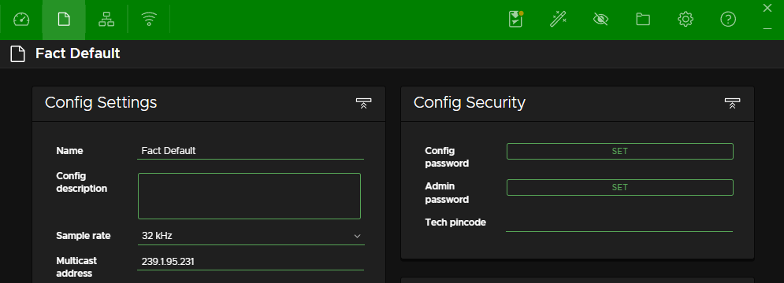

# Green-GO Control Software

## Installation

- [Software Installation (EN)](https://manual.greengoconnect.com/en/getting-started/upgrade/#software-installation)
- [Firmware Upgrade (EN)](https://manual.greengoconnect.com/en/getting-started/upgrade/#upgrade-your-devices)

## Ein Erster Überblick

### Starten der Software: Der Splashscreen

- Der Splashscreen ermöglicht unterschiedliche Enstiege in die Software:
    - Quickstart ermöglicht ein einfaches Erstellen einer ersten Green-GO Konfiguration.
    - Create New ermöglicht das Erstellen einer neuen Konfiguration ohne Hilfestellungen.
    - Load File ermöglicht das Laden einer existierenden Konfiguration.
    - Recent Files hat derzeit keine Funktion.
    - Join ermöglicht es einer im Netzwerk aktiven Konfiguration beizutreten. Die Konfiguration wird von einem verfügbaren Gerät geladen.
- Eine _ausgehende_ Support-Connection muss über den Button support (beta) separat initiiert werden.

### Eine neue Benutzeroberfläche

Die neue Benutzeroberfläche vereint die Funktionen der einzelnen Green-GO v4 Programme.

- Unterschiedliche Ansichten für verschiedene Aufgaben:
    - **Dashboard:** Mehrere sind möglich. Dashboards ermöglichen einen geordneten Blick auf das System.
    - **Config:** Die globalen Systemeinstellungen einer Konfiguration.
    - **Connection:** Verwaltung von Geräten, Firmwares, und Konfiguraitonzugehörigkeit.
    - **Wireless:** Verwaltung von Pairings und Wireless-Verbindungen.
- Verfügbare Tools:
    - **Save to Devices:** Ermöglicht das Speichern der Konfiguration auf die Geräte und damit einen Betrieb ohne die Software.
    - **Assistenten:** Ermöglichen die schnelle Erstellung von Konfigurationselementen.
    - **Support:** Ermöglicht einen Ad-Hock Zugriff durch eine externe Person auf das System und die Konfiguration wenn aktiv.
    - **File:** Ermöglicht das Laden, Mergen, Speichern, etc. von Konfigurationen.
    - **Settings:** Erlaubt die Anpassung bestimmter Programmeinstellungen.
    - **Help:** Ein kontextbasierter Link zum offline Handbuch welches mit der Software ausgeliefert wird.
- Ein **Index-Baum** der alle Elemente der aktiven Konfiguration enthält (mit Suchfunktion).
- Nie **Navigationsleiste** über der Inhaltsansicht teilt die aktive Ansicht mittels Tabs in verschiedene Bereiche auf. Zusätzlich befinden sich hier alle kontextbasierten Aktionen in Form von Buttons.
- Inhaltsansicht der aktiven Elemente oder Ansicht.
- Die **Statusleiste** gibt einen Überblick über Dinge wie den Konfigurationsnamen, Gerätestatus und Warnungen.

## Konfigurations- und Systemverwaltung

### Connection View

**Handbuch:** [Link](https://manual.greengoconnect.com/en/software/views/connection/)

- [Firmware Updates von Geräten via Netzwerk oder USB](https://manual.greengoconnect.com/en/guides/firmware/)
- Änderung der Netzwerk- und Verbindungseinstellungen sind im `Network Tab` verfügbar
- Änderung der Regionseinstellungen sind im `USB Tab` möglich
- Anzeige von verbundenen Applikationen ist im `Application Tab` verfügbar
- Adoptieren von Geräten ist ausschließlich im `Network Tab` möglich
    - Vorgang speichert aktuelle Version der Konfiguration auf dem Endgerät
    - Adoptierte Geräte verlieren Userzuordnung und sind erst nach erneuter Zuordnung einsatzbereit!
- Einer Konfiguration via eines Geräts oder entfernter Softwareinstanz beitreten

### Konfigurations- bzw. Systemeinstellungen

- Konfigurationen laden via dem File-Menü in der Toolbar
    - Mit diesem Tool können auch v4 Konfigurationen geladen und auf v5 geupdated werden (nicht über den Splash-Screen möglich!)
- Konfigurationen mergen via dem File-Menü in der Toolbar
- Es gibt keine Abhängigkeit zwischen Konfigurationsname vs. Dateiname
- Die Konfigurations ID (Config ID) entscheidet über eine Zugehörigkeit einer Konfiguration
- Die Audioqualität wird mit v5 nun Systemweit für alle Teilnehmer und Kanäle definiert (**Warnung:** Ein Wechsel der `Sample-Rate` ändert die `Config ID`!)
    - Die Audioqualität von drahtlosen Green-GO Endgeräten wird von dieser Einstellung nicht beeinflusst!
    - Die Audioqualität für drahtlose Verbindung wird individuell für jedes Endgerät konfiguriert.
- Manuelle Multicast-Adresse ist weiterhin möglich. Ansonsten errechnet die Software beim Erstellen einer neuen Konfiguration eine zufällige Multicast-Adresse (**Warnung:** Ändert die `Config ID`!)
  - Es benötigt eine exklusive Multicast-Adresse pro System. Eine Überschneidung kann zu ungewollten Problemen führen.
- Benutzerdefinierte Statusfarben können im `Config View` angepasst werden
- Passwortschutz für Monitoring (config) und Administration
- Geräte PIN Code ermöglicht Zugriff zu gesperrten Funktionen und Menüs

### Save to Devices

- Unterbricht für ca. 1 - 2 Sekunden die Kommunikation auf **allen** Geräten.
- Wird nur für einen _standalone_ Einsatz ohne die Software benötigt.
- Nicht gespeicherte Änderungen werden mit einem Indikator auf dem Symbol angezeigt.
- Letzter Zeitpunkt der Übertragung wird in der Konfigurationsverwaltung angezeigt.
- Geräte speichern **keine** "überflüssigen" Daten:
    - Script-Quellcode (nur die compilierte Binary wird gespeichert)
    - Templates
    - Aufgezeichnete "Metadata" verschiedener Ansichten.

## Konfigurations Wizards

- IFB Wizard (Kommandokanal)
- One to Many (Kommandokanal _light_)
- Partyline (interaktiver Gruppen Wizard)

## Support Connection

- Ermöglicht einen Ad-Hock Zugriff auf das System und die Konfiguration wenn aktiv
- Nicht für permanente Verbindungen vorgesehen
- Kein Screen-Share, die Verbindung teilt einzig die Konfiguration und Statusinformationen eines Systems
- Funktion für dauerhaften entfernten Zugriff ist in Arbeit