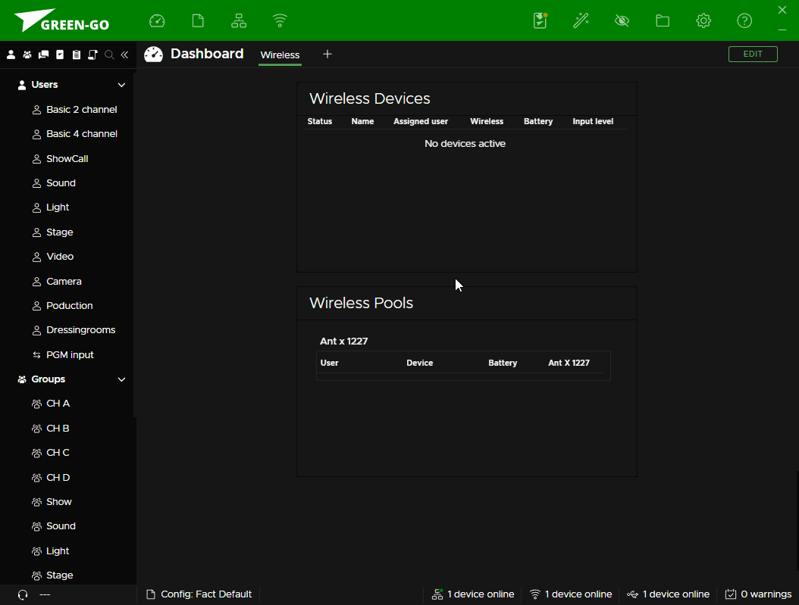

# Wireless mit Green-GO v5

**Handbuch:** [Link](https://manual.greengoconnect.com/en/guides/wirelessx/)

## Allgemeines

- Lizenzfreie drahtlose Kommunikation via DECT:
    - EU: `1880 - 1900 MHz` (10 Trägerfrequenzen)
    - USA/Canada: `1920 - 1930 MHz` (5 Trägerfrequenzen)
    - Japan: `1893 - 1906 MHz` (3 Trägerfrequenzen)
- Bis zu vier Beltpacks können mit einem _Pool_ verbunden (gepaired) werden.
- Maximale Reichweite von bis zu 300 Metern.
- Roaming mit bis zu 7 Antennen ist in Verbindung mit einem [X-Pool](#x-pool-pairing) möglich, ist aber _immer_ mit einer Unterbrechung von ca. `6 - 15 Sekunden` verbunden.

??? warning annotate "Wichtiger Hinweis"
    Green-GO sollte immer in dem von den lokalen Regularien vorgesehenen Frequenzbereich betrieben werden. Der Wechsel in einen anderen Frequenzbereich kann andere Systeme (z.B. Mobilfunk) stören und wird üblicherweise als Straftat angesehen.
    
    Ein Umstellen des Frequenzbereiches ist nur mit Hilfe der Software möglich, die aktuelle Konfiguration kann aber jederzeit über das Setup Menü (1) abgefragt werden.

1. **Setup Menü Wegweiser:** <kbd>Setup Menü</kbd> --> <kbd>Dect</kbd> --> <kbd>Information</kbd> --> <kbd>Region: EU</kbd>

### Wieviele drahtlose Geräte sind möglich? { data-toc-label="function_name" }

Die Anzahl von möglichen drahtlosen Green-GO Beltpacks in einem Empfangsbereich ist nicht immer einfach zu bestimmen und hängt von verschiedenen Faktoren ab:

- Die drei verfügbaren Frequenzbereiche (`EU`, `US/Canada`, `Japan`) verfügen über unterschiedlich viele Trägerfrequenzen mit je 24 Slots und haben daher unterschiedliche Möglichkeiten.
- Das benutzte Green-GO Wireless-Codec haben Einfluss auf die benötigte Bandbreite:
    - `Wideband` (G.722): Bis zu 30 Beltpacks (EU). (1)
    - `Narrowband` (G.726): Bis zu 60 Beltpacks (EU). (2)
- Aktivität von Fremdsystemen im DECT Frequenzbereich (EU: `1,88 - 1,90 GHz`) kann die verfügbare Bandbreite im Frequenzband verringern.
- Green-GO WAA Antennen sind aufgrund fehlender Synchronisation nicht besonders effizient und brauchen unbelegten Aktionsraum im Frequenzband um Kollisionen zu vermeiden. Ist ein Fremdsystem im Einsatz kann das `Narrowband` Codec Abhilfe schaffen, da dies weniger Bandbreite benötigt.
- Die Empfangsqualität im Aktionsraum der Beltpacks kann Einfluss auf die Verbindungsstabilität nehmen. Geräte am Rand des Empfangsbereichs können verhäuft Verbindungsabbrüche oder Probleme beim Verbindungsaufbau erleben. 

1. **Setup Menü Wegweiser:** <kbd>Setup Menü</kbd> --> <kbd>Dect</kbd> --> <kbd>Codec: Wideband</kbd>
2. **Setup Menü Wegweiser:** <kbd>Setup Menü</kbd> --> <kbd>Dect</kbd> --> <kbd>Codec: Narrowband</kbd>

### Roaming mit Green-GO

Roaming mit Green-GO ist nicht nahtlos. Bei jedem Hand-Off muss mit einer Verbindungsunterbrechung von ca. `6 - 15 Sekunden` gerechnet werden. Abseits davon gibt es zwei Möglichkeiten den Zeitpunkt des Antennenwechsels zu beeinflussen:

1. `Roaming Threshold`: Beeinflusst den Zeitpunkt bzw. die berrechnete durchschnittliche Feldstärke für den automatischen Antennenwechsel. (1)
2. `Enforce Roaming`: Ermöglicht einen manuellen Antennenwechsel durch ein kurzes Ziehen am Ein-/Ausschalter und deaktiviert den automatischen Antennenwechsel. (2)

1. **Setup Menü Wegweiser:** <kbd>Setup Menü</kbd> --> <kbd>Dect</kbd> --> <kbd>Roaming Threshold: Default</kbd>
2. **Setup Menü Wegweiser:** <kbd>Setup Menü</kbd> --> <kbd>Dect</kbd> --> <kbd>Force Reconnect: Enabled</kbd>

## Antennen Platzierung

Es gibt ein paar Punkte welche bei der Positionierung einer Antenne zu beachten sind und teilweise erheblichen Einfluss auf die Reichweite einer Green-GO WAA Antenne (Rundstrahler) nehmen können. 

- Die lokale Architektur kann großen Einfluss auf die Empfangsqualität und Reichweite nehmen; abhängig von der Antennenpositionierung und dem Aktionsraum der verbundenen Beltpacks.
- Reflektionen können einen negativen Einfluss auf die Empfangsqualtät nehmen. Aus diesem Grund kann die Positionierung im Raum eine Entscheidene Rolle spielen.
- Bereiche mit existierender Infrastruktur für den gleichen Frequenzbereich (EU: 1,88 - 1,90 GHz) können Einfluss auf die Anzahl der insgesamt möglichen Beltpacks nehmen.
- Abstand zu anderen elektromagnetischen Strahlern (Antennen, Netzteile, WiFi AP/Router, Bluetooth, etc.) sollte min. 1,20 Meter betragen.
- Eine direkte Sichtverbindung vom Beltpack zur Antenne ist vorteilhaft für die Reichweite und Empfangsqualität. Hindernisse jeglicher Art (auch der menschliche Körper) haben einen dämpfenden Einfluss auf alle Radiowellen und sollten, wenn möglich vermieden werden.
- Eine Platzierung über Kopfhöhe ist grundsätzlich empfohlen und Höhe kann einen positiven Performanceeinfluss haben. Aber aufgrund der Funkcharakteristik (Rundstrahler) kann eine zu hohe Platzierung der WAA Antenne eine (zu große) tote Zone direkt unter der Antenne kreieren.
- Die Antenne sollte _aufrecht_ installiert sein (Netzwerkanschluss zeigt entweder nach unten oder oben).

## Pairing Methoden

- Mischbetrieb von OTA- und X-Pools is seit v5 nicht mehr möglich.
- OTA Pairings:
    - One-Shot-Verfahren. Keine nachträgliche Änderung möglich.
    - Kein Roaming möglich.
    - Ausschließlich Monitoring via Software.
- X-Pools:
    - Konfiguration via Software.
    - Roaming mit bis zu 7 Antennen möglich.
    - Hinzufügen und Entfernen von Beltpacks mit USB-Verbindung möglich.
    - Ein drahtloses Beltpack kann immer nur mit einem X-Pool verbunden sein.

### OTA-Pool Pairing

- Der Pairing-Speicher von Antennen und Beltpacks sollte vor Beginn des Pairing-Setups [zurück gesetzt](https://manual.greengoconnect.com/en/guides/wirelessx/#device-preparations) werden.
- Das [Pairing-Setup](https://manual.greengoconnect.com/en/guides/wirelessx/#ad-hock-over-the-air-pairings) erfolgt direkt an den Geräten. Ein direkter Zugriff auf die Geräte ist notwendig.
- Ein Bearbeiten der Pairings ist nicht möglich. Die Software ermöglicht nur das Monitoring.
- Es gibt keine Möglichkeit des Roamings.

#### OTA Workflow

### X-Pool Pairing

- Das Pairing-Setup ist ausschließlich über die Green-GO Control Software möglich.
- WAA Antennen müssen Mitglied der Konfiguration (Adopted) und über das Netzwerk mit der Software verbunden sein bevor diese im Wizard zur Verfügung stehen.
- Ein Abbrechen des Wizards ist nach dem zweiten Schritt nicht mehr möglich.
- Drahtlose Beltpacks werden via USB mit Hilfe der Software programmiert.
- Bei Beltpacks wird ein Pairing direkt nach dem Hinzufügen oder Entfernen programmiert.
- Die Programmierung der Beltpacks kann nacheinander und mit Hilfe eines einzelnen USB-Kabels erfolgen.
- WAA Antennen werden erst nach dem Beenden des Wizards programmiert.
- Ein X-Pool kann jederzeit editiert und angepasst werden.
- Das Löschen eines X-Pools ist erst dann möglich, nachdem alle Antennen und Beltpacks durch das Editieren des X-Pools entfernt wurden.

#### X-Pool Workflow

Das folgende Video zeigt einen groben Überblick über den X-Pool Workflow. Es zeigt das Hinzufügen, editieren und entfernen eines X-Pools.

<figure markdown>

</figure>