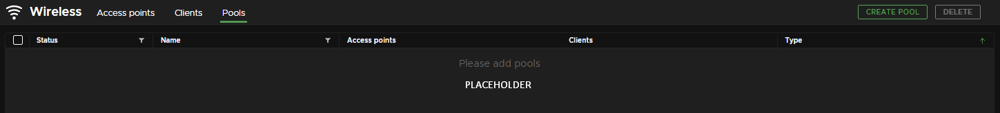

# Wireless Troubleshooting

## Pairing

### Ein OTA-Pairing schlägt fehl

> Sollte ein OTA-Pairing fehlschlagen, so kann dies entweder daran liegen, dass die Antenne bereits voll belegt ist, oder dass das Beltpack bereits ein Pairing gespeichert hat.

Sind die Pairing-Slots der Antenne voll belegt, zeigt die Status-LED dies wie folgt an:

{.img-center .width-90}

In beiden Fällen sollten die [Pairings der Geräte zurückgesetzt](https://manual.greengoconnect.com/en/guides/wirelessx/#device-preparations "Weitere Informationen im offiziellen Green-GO Handbuch") werden (WAA und WBPX). Anschließend kann das Pairing erneut versucht werden.

### Ein X-Pool Pairing schlägt fehl

> Ein X-Pool Pairing kann fehlschlagen, wenn die Antenne bereits voll belegt ist oder die Datenverbindung zu den Geräten beim Programmieren des Pairings unterbrochen wurde.

Ein Problem mit einem Pairing wird in der Regel durch ein :material-alert-outline:{style="color:orange"} Ausrufezeichen am betroffenen X-Pool und Gerät angezeigt.

{.img-center}

Ist dies der Fall, kann einfach der betroffene X-Pool in der "Wireless View" ausgewählt, und über den Button edit das Paring repariert werden. Voraussetung ist aber eine vorhandene Datenverbindung zu den betroffenen Geräten (WAA und WBPX).

### Ein programmiertes Beltpack verbindet sich nicht mehr mit der Antenne

> Dies kann passieren, wenn die Programmierung nicht korrekt abgeschlossen wurde und die Pairinginformationen nicht korrekt gelesen werden können.

Wurden die Geräte mit Hilfe eines OTA-Pairings verbunden, so müssen [alle Pairings zurückgesetzt](https://manual.greengoconnect.com/en/guides/wirelessx/#device-preparations "Weitere Informationen im offiziellen Green-GO Handbuch") werden (WAA und WBPX) und anschließend erneut programmiert werden.

Wurde das X-Pool Pairing verwendet, kann das Pairing mit Hilfe der Software repariert werden:

Dazu muss der betroffene X-Pool in der "Wireless View" ausgewählt, und über den Button edit das Paring durch das Entfernen und erneutes Hinzufügen des betroffenen Geräts repariert werden.

!!! warning ""
    :material-alert-outline: **Achtung:** Voraussetung ist eine vorhandene Datenverbindung zu den betroffenen Geräten (WAA und WBPX).

## Antenne

### Reichweite oder Empfangsqualität ist unbefriedigend

Die Reichweite und Empfangsqualität ist abhängig von verschiedenen Faktoren. Die Reichweite und Empfangsqualität kann von folgenden Dingen beeinflusst und u.U. verbessert werden:

- Antennenposition im abzudeckenden Raum.
- Antennenorientierung (Netzwerkanschluss muss nach oben oder unten zeigen).
- Aktivität von Fremdsystemen im oder an den Grenzen des genutzten Frequenbereichs (EU: `1880 - 1900 MHz`).
- Elektromagnetische Störquellen in der Nähe der Geräte (WAA, WBPX).
- Selbst auslöschende Reflektionen von Wänden, Decken, Böden, etc.

## Beltpacks

### Die Batterielaufzeit ist unbefriedigend

Die Laufzeit des Akkus kann von folgenden Dingen beeinflusst werden:

- Die Anzahl der Ladezyklen hat einen Einfluss auf die Kapazität des Akkus.
- Die Temparatur des Akkus sollte 45°C nicht überschreiten.
- Lagerbedingungen. Der Akku sollte kühl und für längere Perioden bei 50% Ladestand gelagert werden.
- Das Alter des Akkus hat einen Einfluss auf die Kapazität des Akkus.

### Beltpacks nutzen eine unbekannte Kanalbelegung

> Dies ist ein bekanntes Problem welches auftreten kann, wenn die mit einer Antenne verbundenen Beltpacks zum Zeitpunkt der Konfigurationsänderung oder dem Adoptieren nicht eingeschaltet waren.

> In einem solchen Fall kann es passieren, dass die Antenne die Konfigurationsänderung nicht an die Beltpacks übermitteln kann und die Beltpacks nach dem Enschalten die alte Konfiguration nutzen.

Das Problem kann in der Regel durch ein erneutes Laden des Users behoben werden. (1)

Dieser Schritt sollte das Beltpack dazu bringen, die aktuelle Konfiguraiton der Antenne zu laden und den lokalen Cache zu überschreiben.

1. **Setup Menü Wegweiser:** <kbd>Setup Menü</kbd> --> <kbd>User</kbd> --> <kbd>Select User</kbd> --> <kbd>User Name</kbd>

### Beltpacks verlieren (zufällig) die Verbindung

Dies kann vorkommen, wenn das Beltpack beim Wechsel des Frequenzkanals nicht ausreichend Platz für eine Verbindung im Frequenzband finden kann. Dies wird meist durch eine zu hohe Nutzung durch DECT-Fremdsystemen oder eine zu hohe Anzahl an Beltpacks verursacht.

Abhilfe kann hier durch eine Reduzierung der Anzahl an Beltpacks oder eine Reduzierung der Anzahl an DECT-Fremdsystemen geschaffen werden.